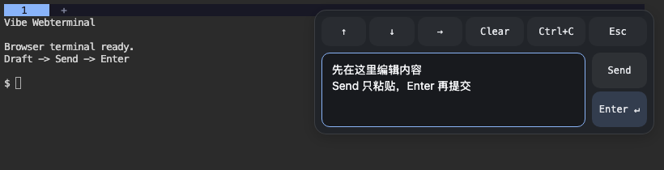

# Vibe Webterminal

把自己的 Mac 终端放进浏览器，在可信内网中用 iPad 操作 Codex、运行命令。支持顶部多 tab、可拖动的多行输入面板，以及断线后继续运行的 Herdr 会话。

当前版本基于 [herdr-tty](https://github.com/dark2momo/herdr-tty) 的 Go 网关，使用标准 [ttyd](https://github.com/tsl0922/ttyd) 和 [Herdr](https://herdr.dev)。源码已包含本项目的 Panel、键盘适配和重连改动，克隆本仓库即可构建。

## 快速上手

需要 macOS、[Homebrew](https://brew.sh) 和 Xcode Command Line Tools（`xcode-select --install`）。

```sh
git clone https://github.com/xhzq233/vibe-webterminal.git
cd vibe-webterminal
./setup.sh
./start.sh
```

`setup.sh` 安装缺少的 Go、ttyd、Herdr，并编译本项目。**请在普通 Mac 终端中运行 `start.sh`，不要从 Herdr 内部的 pane 启动网页服务。** 网页仍可接入已有 Herdr 会话。

启动后打开打印出的地址，默认端口为 7681。在 Mac 另开终端查看登录信息：

```sh
cat ~/.local/share/vibe-webterminal/credential
```

格式为 `username:password`，在网页登录表单中填写。首次部署生成独立密码；重复启动、更新代码均复用现有密码。不要分享该文件。

保持启动服务的终端打开。在该窗口按 **Ctrl+C** 只停止网页访问，Herdr 和其中的任务继续运行。项目不安装开机自启项。

```sh
# 指定新会话的项目目录
./start.sh /path/to/your/project

# 更换端口或指定本机 IPv4 地址
PORT=7682 ./start.sh
BIND_IP=你的内网IP ./start.sh

# 创建另一套独立会话
VIBE_SESSION=another-project PORT=7682 ./start.sh /path/to/project
```

## Panel 操作



Panel 默认位于可见区域上方，给终端底部输入区留出空间。拖动按钮或面板背景可以调整位置；靠近边缘不会缩小或隐藏。输入框支持多行显示，长草稿可在框内滚动。

| 操作 | 行为 |
| --- | --- |
| 输入框中的键盘 Enter | 只在草稿中换行，不发送到终端 |
| Send | 把草稿粘贴到终端当前输入位置，清空草稿，但不发送回车 |
| Panel Enter | 只向终端发送回车，不带上尚未 Send 的草稿 |
| ↑ / ↓ / → | 终端方向键 |
| Ctrl+C | 通常用于中断前台命令 |
| Clear | 发送 Ctrl+L；由当前终端程序处理 |
| Esc | 发送 Escape |

在 Codex 中，先在 Panel 编辑内容，点 **Send** 放入 Codex 的输入区，确认后再点 **Enter** 提交。Send 是粘贴，不会先清空终端里已有的输入。终端程序如何处理多行粘贴由该程序决定。

在终端上单指滑动会传给 Herdr，并保留惯性滚动；页面本身不会随手势平移。长按拖动可选中文字并复制，双指轻点发送右键。

## 键盘弹出时

- 终端行列数保持不变，Codex 不因软键盘出现而重新排版。
- 终端底部始终对齐键盘上方的可见区域；上方内容暂时裁切，不留下空白条。
- 收起键盘后恢复完整画面。旋转设备或真正改变浏览器窗口尺寸时，终端仍会适配新尺寸。
- Panel 独立定位，默认靠上，并给底部输入和状态行留出空间。

## 只保留顶部 tab

如果希望隐藏 Herdr 侧边栏，将以下设置合并到 `~/.config/herdr/config.toml`。已有 `[ui]` 时修改其中的对应项，不要重复添加同名段：

```toml
[ui]
sidebar_start_collapsed = true
sidebar_collapsed_mode = "hidden"
hide_tab_bar_when_single_tab = false
tab_bar_position = "top"
```

```sh
herdr config check
herdr --session vibe-webterminal server reload-config
```

然后断开并重新进入网页，让新客户端应用启动布局。顶部的「＋」用于新建 tab。配置作用于使用这份配置的 Herdr，不会停止现有任务。

## 会话与自动重连

网页默认接入 `herdr --session vibe-webterminal`。首次连接创建会话，之后复用。进入后运行 `codex` 即可；首次 Herdr 引导按提示完成，断线保活不要求安装可选 Agent 集成。

- 刷新网页、iPad 灭屏断网或停止网页服务，只会断开客户端，Herdr 中的任务继续运行。
- 网络恢复后自动重试连接；重连或登录恢复过程保留尚未发送的 Panel 草稿，恢复后不会自动提交。
- 登录有效期默认 7 天。签名密钥保存在状态目录，重启网页服务不会使仍有效的登录失效；登录过期时自动转到登录页。
- 多个网页共享同一会话。项目目录参数只用于创建新会话；重连保留原工作区和目录。
- Mac 睡眠会暂停执行，关机或停止 Herdr 会结束进程；这不等同于 Agent 对话恢复。

```sh
# 在普通 Mac 终端进入同一会话
herdr --session vibe-webterminal

# 仅在确实要结束该会话及其中任务时执行
herdr session stop vibe-webterminal
```

## 更新旧版

停止**网页服务**后，在干净的仓库中执行：

```sh
git pull --ff-only
./setup.sh
./start.sh
```

默认沿用 `~/.local/share/vibe-webterminal/credential` 和同名 Herdr 会话。新版改为表单登录，首次升级需要登录一次；之后更新会保留有效登录。旧版直接 shell 的进程不会自动迁入 Herdr。

如果此前使用了自定义状态目录或会话名，启动时继续使用相同的 `VIBE_STATE_DIR`、`VIBE_SESSION`。`VIBE_SESSION_KEY_FILE` 可指定已有签名密钥文件；不要删除或覆盖正在使用的密钥。

## 常见问题

- **页面打不开**：确认网页服务在运行、设备能访问该 Mac 的网络，以及 macOS 允许入站连接。换网络后重新启动并使用新打印的地址。
- **端口被占用**：使用 `PORT=7682 ./start.sh`，或停止原来的网页服务。
- **提示不能在 Herdr 中启动**：从普通 Terminal/iTerm 窗口启动；这是防止嵌套启动，不影响接回已有会话。
- **Send 后命令没执行**：这是预期行为，再点 Panel 的 Enter 才发送回车。
- **键盘出现后看不到顶部 tab**：上方内容被暂时裁切，收起键盘即可恢复。
- **反复登录**：使用同一个状态目录和 `session-key` 文件，并检查登录是否过期。不要混用旧版 Basic 认证启动脚本。

## 构建与验证

Go 1.23+ 可直接运行 `make build`，产物为 `bin/herdr-tty`。手工运行该程序时默认监听本机回环地址；Mac 启动脚本使用检测到的内网地址并强制表单认证。

```sh
make check  # Go race tests、vet、构建，以及 Node.js 前端行为检查
```

Node.js 仅用于开发检查，不是运行依赖。主要文件：

- `setup.sh` / `start.sh`：Mac 安装与启动入口。
- `internal/app/web/mobile.js` / `mobile.css`：Panel、触摸、键盘适配和重连。
- `internal/app`：Go 网关、Cookie 登录和 ttyd 进程管理。
- `third_party/herdr-tty.LICENSE`：上游许可证。

已使用 Herdr 0.9.0、ttyd 1.7.7 验证登录、Send/Enter 分离、多行输入、断网重连、服务重启保留登录，以及断开后同一 shell 继续运行。键盘适配已用真实 Codex 界面配合浏览器视口模拟验证；真实设备体验以使用反馈为准。

本项目面向可信内网，默认 HTTP 加密码登录，不包含 HTTPS 或公网部署配置。仓库不携带个人凭据、机器地址、日志或编译产物。组件来源与许可证见 [THIRD_PARTY.md](THIRD_PARTY.md)。
